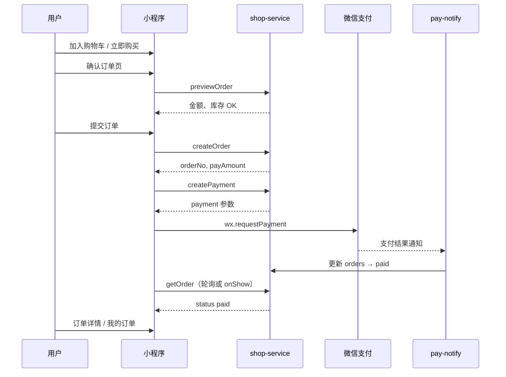

# TOPUYI 真下单规划（周边商城）

> 目标：把 `pages/around/` 从**演示商城**升级为**可支付、可发货、可查单**的真电商能力。  
> 前提：TOPUYI 独立云 `cloud1-d4grfezxdaca540d6`，与有米数据不互通（沿用方案 C）。

---

## 1. 现状与差距

| 能力 | 现状 | 真下单需要 |
|------|------|------------|
| 商品展示 | `around.js` 内写死 `PRODUCTS` | 云数据库 `products`，支持上下架、库存 |
| 购物车 | 本机 `demoCart` | 登录用户云端 `carts` 或下单前合并 |
| 下单 | 弹窗提示「暂不支持下单」 | 确认订单 → 创建 `orders` → 调起微信支付 |
| 支付 | 无 | 微信支付 JSAPI + 支付回调云函数 |
| 地址 | 无 | `addresses` 集合 + 收货地址页 |
| 订单查询 | 无 | 「我的订单」列表 + 详情 |
| 发货 | 无 | 管理端发货 / 后续接 1688 |
| 登录 | 手机号（可本地兜底） | **必须**稳定 `openid`（云函数登录），支付强依赖 openid |

演示页关键位置：

- 商品：`pages/around/around.js` → `PRODUCTS` 常量
- 购物车：`wx.getStorageSync('demoCart')`
- 文案：`pages/around/around.wxml`「暂不支持真实下单」

---

## 2. 推荐架构（一期：云开发为主）

与群控一致，**小程序只调云函数，不直写订单/商品库**（防篡改价格、库存）。

```
┌─────────────┐     callFunction      ┌──────────────────┐
│  小程序      │ ───────────────────► │  shop-service     │
│  around/    │                       │  (新建云函数)      │
│  checkout/  │ ◄─────────────────── │  pay-notify/      │
│  orders/    │     result / 轮询      │  (支付回调)        │
└─────────────┘                       └────────┬─────────┘
                                               │
                    ┌──────────────────────────┼──────────────────────────┐
                    ▼                          ▼                          ▼
              products                   orders                    users
              carts                      order_items               addresses
```

**为何不用先上 `api.topuyi.com`？**

- 一期上线快：商品少、无复杂 ERP，云开发足够
- 与 `group-service` / `user-service` 同环境、同部署流程
- 二期若接 1688、WMS、多仓，再在云函数内转发到自建 API，小程序接口可不变

---

## 3. 微信支付前置（阻塞项，尽早办）

| 项 | 说明 |
|----|------|
| 主体 | 需**企业**小程序（个人号无法开通微信支付） |
| 商户号 | [微信支付商户平台](https://pay.weixin.qq.com) 申请，绑定 TOPUYI AppID `wx3610c3ef05d1131e` |
| 云开发支付 | 云开发控制台 → 设置 → 微信支付 → 绑定商户号；或使用「云开发微信支付」模板 |
| 类目 | 小程序后台类目需含零售/电商相关，否则提审可能被拒 |
| 测试 | 沙箱/体验版可用小额测试；正式环境需商户号审核通过 |

**没有商户号时仍可开发**：商品、购物车、下单页、订单状态机（`pending_pay` 模拟），支付按钮置灰或走「0.01 元测试」开关。

---

## 4. 数据库设计（云开发集合）

权限建议：**全部「仅管理端可读写」**，读写只走云函数（与 `groups` 相同策略）。

### 4.1 `products` 商品

```javascript
{
  _id: 'prod_xxx',           // 或自动生成
  sourceAppId: 'wx3610c3ef05d1131e',
  sku: 'stick-01',           // 业务 SKU，唯一
  name: 'TOPUYI 经典荧光棒',
  desc: '...',
  category: 'stick',         // stick | ball
  images: ['cloud://...'],   // 云存储 URL，一期可继续用 CSS 占位图
  price: 1290,               // 单位：分（整数，避免浮点）
  originalPrice: 1590,       // 可选，划线价
  stock: 100,
  status: 'on_sale',         // on_sale | off_sale
  tag: '热销',
  sort: 100,
  createdAt: 0,
  updatedAt: 0
}
```

索引：`sku`（唯一）、`status + sort`、`sourceAppId`。

### 4.2 `carts` 购物车（可选，一期也可用本机 + 下单时提交）

```javascript
{
  openid: '...',
  sourceAppId: '...',
  items: [
    { productId: '...', sku: 'stick-01', qty: 2, priceSnapshot: 1290 }
  ],
  updatedAt: 0
}
```

索引：`openid`（唯一）。

### 4.3 `addresses` 收货地址

```javascript
{
  openid: '...',
  sourceAppId: '...',
  name: '张三',
  phone: '13800138000',
  province: '广东省',
  city: '深圳市',
  district: '南山区',
  detail: 'xx路xx号',
  isDefault: true,
  createdAt: 0,
  updatedAt: 0
}
```

索引：`openid`。

### 4.4 `orders` 订单

```javascript
{
  orderNo: '20260610143022001',  // 业务单号，唯一
  sourceAppId: 'wx3610c3ef05d1131e',
  openid: '...',
  status: 'pending_pay',   // 见下文状态机
  items: [
    {
      productId: '...',
      sku: 'stick-01',
      name: 'TOPUYI 经典荧光棒',
      qty: 2,
      unitPrice: 1290,       // 下单时快照
      lineAmount: 2580
    }
  ],
  totalAmount: 2580,         // 商品总额（分）
  freightAmount: 0,          // 运费（分）
  payAmount: 2580,           // 实付 = 总额 + 运费 - 优惠
  addressSnapshot: { ... },  // 下单时地址快照
  remark: '',
  payChannel: 'wxpay',
  transactionId: '',         // 微信支付单号，支付成功后写入
  paidAt: 0,
  shippedAt: 0,
  completedAt: 0,
  cancelledAt: 0,
  cancelReason: '',
  createdAt: 0,
  updatedAt: 0
}
```

索引：`orderNo`（唯一）、`openid + createdAt`、`status + createdAt`。

### 4.5 订单状态机

```
pending_pay ──支付成功──► paid ──发货──► shipped ──确认收货/超时──► completed
     │                      │
     └──超时/用户取消──► cancelled
```

| 状态 | 含义 | 允许操作 |
|------|------|----------|
| `pending_pay` | 待支付 | 支付、取消（15–30 分钟未付自动取消） |
| `paid` | 已支付待发货 | 管理端发货 |
| `shipped` | 已发货 | 用户确认收货 |
| `completed` | 已完成 | 只读 |
| `cancelled` | 已取消 | 只读；若已支付需走退款流（二期） |

---

## 5. 云函数设计

### 5.1 `shop-service`（主业务）

与 `group-service` 相同模式：`action` 分发 + `openid` / `sourceAppId` 校验。

| action | 说明 | 调用方 |
|--------|------|--------|
| `listProducts` | 分页列表，仅 `on_sale` | around 页 |
| `getProduct` | 详情 | 商品详情 |
| `getCart` / `setCart` | 购物车读写 | around / cart |
| `listAddresses` / `saveAddress` / `deleteAddress` | 地址 CRUD | 地址页 |
| `previewOrder` | 算价、校验库存 | 确认订单页 |
| `createOrder` | 锁库存、写 `pending_pay`、返回 `orderNo` | 确认订单 |
| `createPayment` | 调统一下单，返回 `payment` 参数给 `wx.requestPayment` | 支付 |
| `listOrders` / `getOrder` | 我的订单 | orders 页 |
| `cancelOrder` | 用户取消待支付单 | 订单详情 |
| `confirmReceive` | 确认收货 | 订单详情 |

**安全要点（必须做）：**

- 价格、库存**只在云函数读库计算**，不信任客户端传入的 `price`
- `createOrder` 用事务或「先减库存 + 失败回滚」防超卖
- `orderNo` 服务端生成；`payAmount` 与订单库一致后再调支付

### 5.2 `pay-notify`（支付回调）

- 微信服务器 POST 通知（云函数 HTTP 触发或云开发支付内置回调）
- 验签 → 查 `orders` → 幂等更新为 `paid`、写 `transactionId`
- **勿**在小程序端仅凭 `requestPayment success` 就把订单标为已付（可能掉单）

### 5.3 管理端（一期可简化）

任选其一：

1. **云开发控制台** 手动改 `orders.status`、填快递单号字段 `trackingNo`（最快）
2. 简单 **Web 管理页**（云托管 / 独立后台，二期）
3. 企业微信 webhook：新订单推送（**已实现** `notify-wecom.js`，配置见 [`SHOP_WECOM_NOTIFY.md`](SHOP_WECOM_NOTIFY.md)）

---

## 6. 小程序页面与改造

### 6.1 改造现有页

| 页面 | 改动 |
|------|------|
| `pages/around/around` | 商品改 `shop-service.listProducts`；购物车可保留本机，下单前 `previewOrder` |
| `pages/mine/mine` | 增加入口：「我的订单」「收货地址」 |

### 6.2 新增页（建议）

| 路径 | 作用 |
|------|------|
| `pages/checkout/checkout` | 选地址、明细、运费、提交订单 |
| `pages/address-list/address-list` | 地址列表 |
| `pages/address-edit/address-edit` | 新增/编辑地址（可用 `wx.chooseAddress` 辅助） |
| `pages/orders/orders` | 订单列表（Tab：全部/待付款/待发货/待收货） |
| `pages/order-detail/order-detail` | 订单详情、去支付、确认收货 |

### 6.3 工具层

新建 `utils/shop-cloud.js`（仿 `utils/group-cloud.js`）：

- `callShopService(payload)`
- `parseShopError(error)`
- `showShopError(title, message)`

### 6.4 下单主流程



---

## 7. 分阶段实施（建议排期）

### Phase 0：基础就绪（与群控并行，约 1–2 天）

- [ ] `cloudfunctions` 绑定云环境，部署 `user-service`（支付需要稳定 openid）
- [ ] 登录禁止长期 `localOnly` 下单（下单前检测并提示先完成云端登录）
- [ ] 申请/确认微信支付商户号进度

### Phase 1：MVP 可下单未支付（约 3–5 天）

- [ ] 建集合：`products`、`orders`、`addresses`（`carts` 可选）
- [ ] 导入首批商品（把现有 `PRODUCTS` 迁到 `products`，价格改「分」）
- [ ] 实现 `shop-service`：`listProducts`、`previewOrder`、`createOrder`、`listOrders`、`getOrder`、`cancelOrder`
- [ ] 改造 `around` + 新增 `checkout`、`orders`、`order-detail`
- [ ] 支付按钮：商户号未就绪时显示「支付开通中」，订单停留在 `pending_pay`

**验收**：能浏览云商品、填地址、生成真实订单号、在「我的订单」看到待付款。

### Phase 2：微信支付闭环（约 3–5 天，依赖商户号）

- [ ] `shop-service.createPayment` + `pay-notify`
- [ ] 待支付超时取消（云函数定时触发器，如每 5 分钟扫 `pending_pay`）
- [ ] 支付成功页 / 订单状态自动刷新
- [ ] 真机 0.01 元冒烟

**验收**：完整「下单 → 支付 → 订单变已付款」。

### Phase 3：发货与运营（约 2–3 天）

- [ ] 订单增加 `trackingNo`、`expressCompany`
- [ ] 管理端发货（控制台或简易后台）
- [x] 新订单企业微信推送（`notify-wecom.js`，支付成功后在 `pay-notify` 调用）
- [ ] 用户确认收货 → `completed`

### Phase 4：增强（按需，2 周+）

- [ ] 优惠券 / 满减
- [ ] 退款（`refund` 接口 + 状态 `refunding`）
- [ ] 商品图云存储、富文本详情
- [ ] 1688 代发：商品 `externalSku`、下单后调 1688 创建采购单、物流回传
- [ ] 迁到 `api.topuyi.com` 统一中台（多小程序、多仓）

---

## 8. 1688 代发（二期备忘）

不在 MVP 做，但数据结构预留：

```javascript
// products 扩展
{
  supplyType: 'self' | '1688',
  externalOfferId: '...',
  externalSkuId: '...'
}

// orders 扩展
{
  fulfillment: {
    type: '1688',
    purchaseOrderId: '',
    status: 'pending' | 'placed' | 'shipped'
  }
}
```

流程：用户付款 → `paid` → 异步任务调 1688 下单 → 回写物流 → `shipped`。需 1688 开放平台应用、代发协议、失败重试与客服兜底。

---

## 9. 合规与提审清单

- [ ] 隐私政策、用户协议（含订单与个人信息）
- [ ] 电商类目资质（营业执照等）
- [ ] 商品详情真实、价格与支付一致
- [ ] 售后说明（7 天无理由等按品类）
- [ ] 支付场景说明；勿引导线下交易

---

## 10. 与演示商城迁移策略

1. **数据**：写一次性脚本或云控制台导入，把 `around.js` 的 8 个 SKU 写入 `products`
2. **兼容**：`around.js` 保留 `PRODUCTS` 作离线 fallback，云拉取失败时降级（可选）
3. **购物车**：Phase 1 可继续 `demoCart`，点击「去结算」时把 items 传给 `checkout`；Phase 2 再迁云端 `carts`
4. **文案**：去掉「演示商城」提示，改为真实售后说明

---

## 11. 工作量粗估

| 阶段 | 人天（1 名全栈） | 阻塞 |
|------|------------------|------|
| Phase 0 | 1–2 | 云环境、user-service |
| Phase 1 MVP | 3–5 | 无 |
| Phase 2 支付 | 3–5 | **商户号** |
| Phase 3 发货 | 2–3 | 运营流程 |
| Phase 4 1688 | 10+ | 1688 签约与 API |

---

## 12. 建议的下一步（执行顺序）

1. **确认商户号**：有 → 按 Phase 1+2 连续做；无 → 先做 Phase 1，支付接口留桩  
2. **建表**：`products`、`orders`、`addresses`  
3. **新建** `cloudfunctions/shop-service` + `utils/shop-cloud.js`  
4. **商品入库**：从 `PRODUCTS` 迁移  
5. **做 checkout + orders 页**，再接支付  

需要开始写代码时，建议从 **Phase 1** 动手：`shop-service` 骨架 + `products` 导入 + `checkout` 页。可在 Agent 模式下直接实现。

---

## 附录：与现有模块关系

| 模块 | 关系 |
|------|------|
| `group-service` | 独立，不共用表 |
| `user-service` | 共用 `users`；下单用 `openid` |
| `utils/cloud-config.js` | 同一 `CLOUD_ENV_ID` |
| `pages/around` | 主要改造入口 |
| `pages/mine` | 增加订单/地址入口 |
